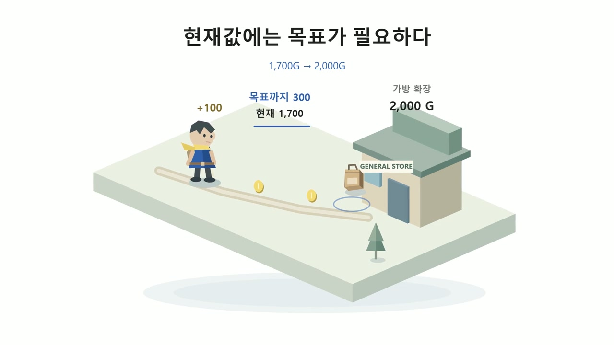
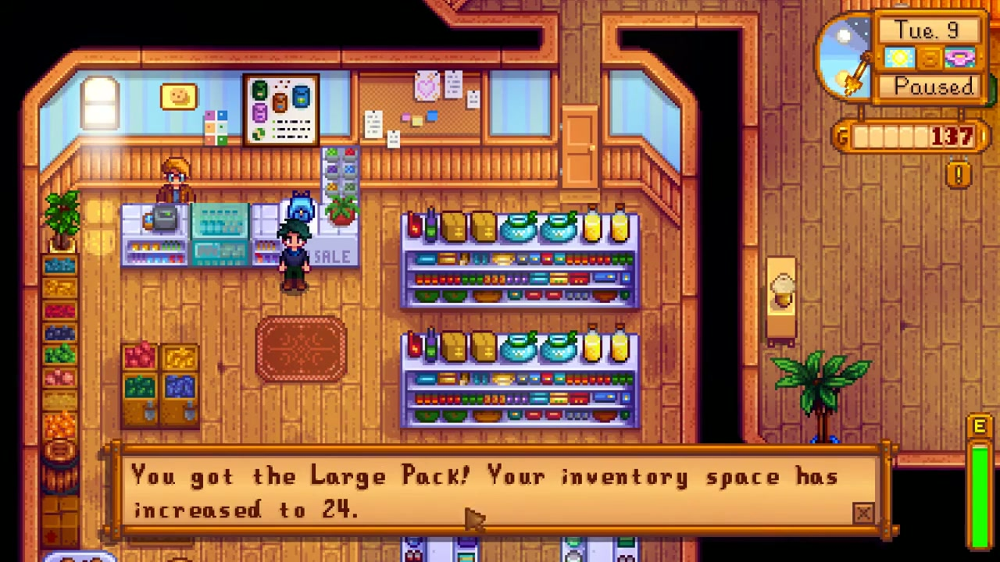
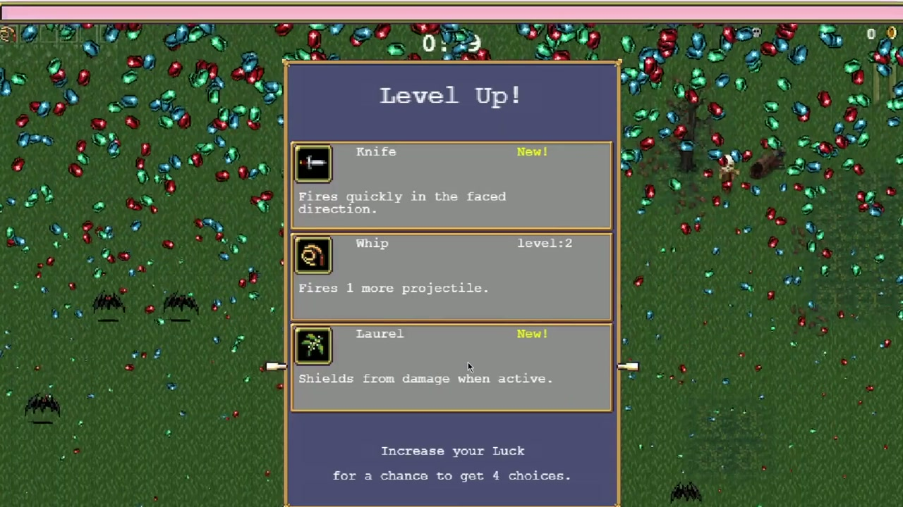
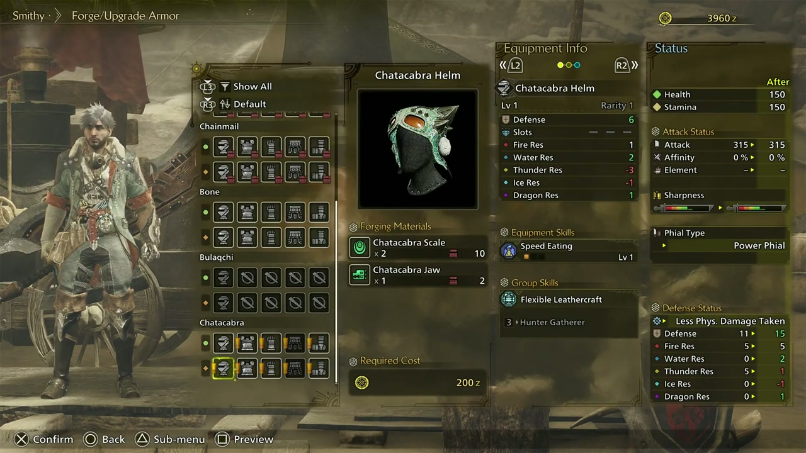
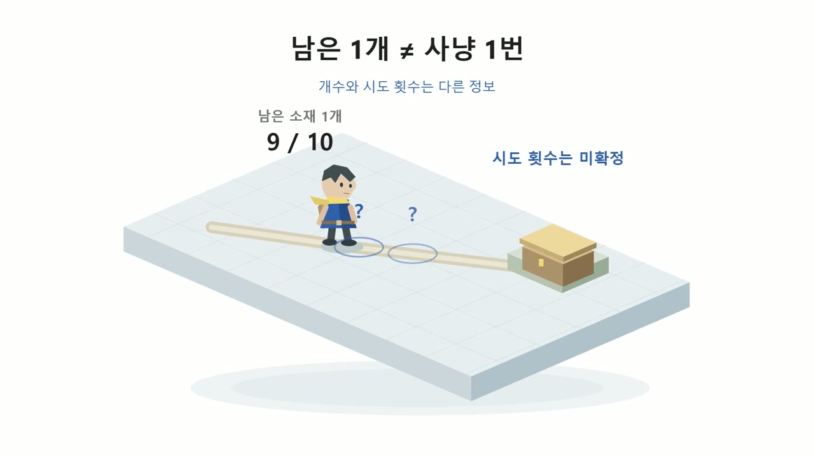

영상 게시 대기 · 얌얌코딩 「왜 조금만 더 하게 될까? | 보상이 보이는 게임 디자인」의 유튜브 게시 주소가 확인되면 이 자리에 영상을 넣습니다. 아래 본문과 그림만으로도 내용을 읽을 수 있습니다.

오늘은 여기까지만 하려고 했습니다. 그런데 상점에서 사고 싶었던 가방이 떠오릅니다. 가격은 2,000골드. 지금 가진 돈이 1,700골드라면 딱 300골드가 남았습니다.

“아, 이것만 더 모으면 되겠는데?”

종료 버튼으로 가던 마음이 다시 게임으로 돌아옵니다. 무조건 큰 보상을 주었기 때문은 아닙니다. 내가 원하는 변화가 무엇인지, 그 변화까지 얼마나 남았는지 알게 되었기 때문입니다. 이번에는 스타듀밸리, 뱀파이어 서바이버스, 몬스터 헌터 와일즈를 보며 **보상을 보이게 만든다는 것이 무엇인지** 생각해봅시다. 게임을 직접 해보지 않았어도 괜찮습니다.

## 가방이 왜 보상이 될까?

스타듀밸리에서는 농사를 짓고, 낚시를 하고, 광산에서 물건을 모읍니다. 그런데 가방에는 담을 수 있는 종류의 수가 정해져 있습니다. 도구와 수집품으로 칸을 채우고 나면 새로 발견한 물건 앞에서 고민하게 됩니다. 무엇을 두고 갈까? 집에 다녀와야 할까?

이 경험 뒤에 더 큰 가방을 만나면, 단순한 아이콘이 다르게 보입니다. “더 많이 담을 수 있다”는 설명이 “다음에는 덜 버리고 더 멀리 다녀올 수 있다”는 기대가 됩니다. 보상의 가치는 숫자 안에만 있지 않습니다. 그 보상을 얻은 뒤 바뀔 플레이 안에도 있습니다.

물론 보상을 팔기 위해 일부러 불편함을 과하게 만들자는 뜻은 아닙니다. 기본 플레이가 괴롭고 보상만 탈출구라면, 플레이어는 성장보다 숙제를 느낄 수 있습니다. 지금도 재미있지만 다음에는 다른 방식으로 놀 수 있다는 기대가 좋은 출발점입니다.

우리가 만드는 게임의 보상에도 물어봅시다. 새 검을 얻으면 숫자만 커질까요, 아니면 전에는 어려웠던 적을 다른 방법으로 상대할 수 있을까요? 새 길이 열리면 체크 표시만 늘어날까요, 아니면 궁금했던 장소에 갈 수 있을까요?

## 현재값에 목표를 붙이면, 숫자가 거리가 된다

화면에 ‘1,700’만 적혀 있다고 생각해봅시다. 돈이 있다는 것은 알지만, 충분한지는 알 수 없습니다. 옆에 원하는 가방의 가격 ‘2,000’이 붙으면 이야기가 달라집니다. 플레이어가 두 숫자 사이에서 남은 거리를 읽을 수 있습니다.

*그림 1 · 완성 영상 01:57. 현재 1,700G, 목표 2,000G, 남은 300G를 하나의 경로로 연결한 자체 제작 도식입니다. 1,700G와 300G는 설명용 가정이며, 실제 플레이 화면의 소지금을 수정한 것이 아닙니다.*

이제 수확물을 팔거나 물건을 모으는 작은 행동에도 방향이 생깁니다. 방금 얻은 돈이 단순한 획득 알림이 아니라 ‘원하는 변화에 조금 가까워졌다’는 소식이 되는 것입니다.

여기에는 세 가지 정보가 함께 있습니다. 원하는 것, 현재 가진 것, 남은 것. 반드시 같은 모양의 진행 바를 써야 하는 것은 아닙니다. 상점의 가격표, 제작 메뉴의 재료 목록, 지도에서 바라보이는 목적지가 같은 역할을 할 수도 있습니다. 중요한 것은 플레이어가 다음 행동을 판단할 만큼 관계를 읽을 수 있는가입니다.

## 얻는 순간보다, 얻은 다음을 보여주자

스타듀밸리의 첫 가방 확장은 2,000골드로 인벤토리를 12칸에서 24칸으로 늘립니다. 구매 장면에서 가방을 얻었다는 연출과 늘어난 공간에 대한 안내가 나옵니다. 이때 플레이어는 돈을 지불한 결과를 확인할 수 있습니다.

*그림 2 · 완성 영상 02:24. “인벤토리 공간이 24칸으로 늘었다”는 구매 결과 안내가 표시됩니다. 반짝이는 획득 연출에 더해 무엇이 달라졌는지를 알려주는 장면입니다. 게임: ConcernedApe / 녹화: Lin LP.*

하지만 좋은 획득 효과만으로 설계가 끝나는 것은 아닙니다. 다시 광산에 갔을 때 조금 더 많은 물건을 가져올 수 있어야 하고, 이전에 포기했던 선택을 할 수 있어야 합니다. 보상 전에 기대했던 변화와 보상 뒤에 실제로 느끼는 변화가 이어져야 합니다.

직접 만든 게임이라면 보상을 지급한 직후의 30초를 확인해봅시다. 새 능력을 쓸 대상이 있는지, 새 이동기로 넘어갈 공간이 있는지, 무엇이 좋아졌는지 알아차릴 기회가 있는지 살펴봅니다. 보상 설명을 길게 쓰기 전에 보상을 사용해볼 상황을 만드는 편이 더 분명할 수 있습니다.

## 경험치 바의 끝에는 다음 판단이 있다

뱀파이어 서바이버스에서는 적과 싸우고 경험치를 모으면 레벨업 선택을 만납니다. 화면 위의 경험치 바는 다음 레벨까지의 진행을 보여주고, 레벨업 뒤에는 무기나 강화 등의 선택지가 등장합니다.

*그림 3 · 완성 영상 03:12. 경험치를 모은 결과가 Knife, Whip, Laurel 가운데 고르는 화면으로 이어집니다. 진행 바의 끝에는 숫자 증가뿐 아니라 다음 전투를 어떻게 바꿀지 판단하는 순간이 있습니다. 게임: poncle / 녹화: G-Gou_Plays.*

그래서 플레이어가 기다리는 것은 바가 가득 차는 순간만이 아닐 수 있습니다. 이번에 부족한 공격 방향을 보완할지, 이미 가진 무기를 강화할지 같은 다음 판단도 기다립니다. 선택한 결과는 이어지는 전투에서 다시 경험하게 됩니다.

여기서 ‘다음 레벨에 도달할 수 있다’는 정보와 ‘원하는 선택지가 반드시 나온다’는 정보는 구분해야 합니다. 진행을 알려준다고 모든 결과가 확정되는 것은 아닙니다. 무엇이 확실하고 무엇이 아직 미정인지 읽을 수 있어야 기대도 정확해집니다.

## 눈에 보이게 한다고, 전부 화면에 붙일 필요는 없다

보상이 중요하다고 모든 목표와 수집품을 화면 구석에 고정하면 어떻게 될까요? 다음 장비의 재료, 오늘의 과제, 수집 도감, 다른 지역의 보상까지 한꺼번에 보입니다. 정보는 많아졌는데 지금 할 일은 오히려 흐려질 수 있습니다.

계속 확인해야 하는 진행은 화면에 남길 수 있습니다. 반면 장비를 비교할 때만 필요한 재료는 제작 메뉴에서 자세히 보여줄 수 있고, 한 번 확인하면 되는 획득 결과는 짧은 알림으로 전달할 수 있습니다. 기준은 정보의 중요도만이 아니라 **그 정보가 지금 어떤 판단을 돕는가**입니다.

게임 화면을 잠시 멈추고 플레이어에게 물어보는 방법도 있습니다. 지금 무엇을 원하고, 얼마나 남았고, 어디에서 확인하면 되는지 설명할 수 있을까요? 답을 찾기 어렵다면 표시를 더 넣기 전에 위치와 표현, 보여주는 시점을 먼저 살펴봅시다.

## 소재 한 개와 사냥 한 번은 같은 말이 아니다

몬스터 헌터 와일즈의 제작 메뉴를 보면 만들 장비와 필요한 소재, 현재 보유량, 비용을 함께 확인할 수 있습니다. 장비의 생김새와 성능도 보입니다. 만들고 싶은 물건과 준비해야 할 조건을 연결하는 화면입니다.

*그림 4 · 완성 영상 04:45. Chatacabra Helm의 제작 소재와 보유량, 비용, 성능이 함께 보입니다. 이 캡처의 Scale은 필요 2개·보유 10개, Jaw는 필요 1개·보유 2개이므로 ‘하나가 부족한 화면’이 아닙니다. 게임: CAPCOM / 녹화: Raizen Games.*

이번에는 실제 화면과 구분해서 가상의 재료 수집 상황을 만들어봅시다. 열 개가 필요한데 아홉 개를 모았습니다. 남은 수량은 분명히 하나입니다. 하지만 그 재료를 사냥에서 확률적으로 얻는 설정이라면, 앞으로 사냥을 한 번만 하면 된다는 뜻은 아닙니다.

*그림 5 · 완성 영상 05:12. ‘9/10’과 ‘시도 횟수는 미확정’을 나란히 보여주는 자체 제작 예시입니다. 특정 몬헌 소재의 실제 드롭률이나 보장 횟수를 재현한 도식이 아닙니다.*

이 차이를 흐리면 처음에는 가까워 보이던 목표가 반복해서 멀어지는 느낌을 줄 수 있습니다. 부족한 개수와 예상 노력은 다른 정보이기 때문입니다. 설계에 따라 획득 경로를 안내하거나, 교환처럼 결과가 확실한 경로를 함께 제공하는 방법을 검토할 수 있습니다. 모든 게임에 같은 장치를 넣으라는 뜻이 아니라, 플레이어가 가진 정보로 기대를 합리적으로 세울 수 있게 하자는 것입니다.

보상을 눈앞에 둔다는 원칙은 결과를 과장하라는 뜻이 아닙니다. 가까움을 보여줄수록 불확실성도 정직하게 다뤄야 합니다.

## 우리 게임에서는 어떤 변화를 기다리게 할까?

작은 탐험 게임을 만든다고 생각해봅시다. 첫 보상은 더 큰 가방입니다. 화면 한쪽에 돈만 적기 전에, 플레이어가 가방의 쓸모를 경험할 장면부터 그려봅니다. 흥미로운 물건을 발견하고, 가져갈 것을 고르고, 다음 탐험을 준비하는 흐름입니다.

그다음 상점에서 현재 돈과 가격을 비교할 수 있게 합니다. 물건을 팔면 목표에 가까워졌다는 것을 알 수 있게 하고, 구매 뒤에는 새 공간을 확인하게 합니다. 다시 탐험에 나가면 그 공간을 활용할 기회가 있어야 합니다. ‘원한다 → 가까워진다 → 얻는다 → 달라진다’가 하나의 경험으로 이어집니다.

이 흐름을 친구에게 보여주고 왜 그 보상을 갖고 싶은지 물어봅시다. “화살표가 시켜서”라는 대답만 나온다면 보상 표시보다 보상의 의미를 다시 볼 필요가 있습니다. 반대로 “저걸 얻으면 다음에는 저곳까지 다녀오고 싶다”는 말이 나온다면, 보상이 다음 플레이와 연결되기 시작한 것입니다.

보상 설계의 목적은 종료 버튼을 누르지 못하게 만드는 데 있지 않습니다. 플레이어가 자기 목표를 이해하고, 진행을 느끼며, 원하는 시점에 쉬었다가 다시 돌아올 이유를 갖게 하는 데 있습니다. 보상까지 가는 과정도 재미있어야 합니다. 보상은 그 재미를 대신하는 미끼가 아니라, 다음 플레이에 건네는 약속입니다.

---

### 자료와 그림

이 글은 얌얌코딩 「왜 조금만 더 하게 될까? | 보상이 보이는 게임 디자인」의 승인 대본과 2026-09-17 최종 v3 영상에서 읽기용으로 다시 구성했습니다. 캡처 시간은 6분 15.767초 완성본 기준입니다. 수치 도식과 적용 연습은 가상 설계이며, 디자인 해석은 개발사의 공식 의도나 사용자 실험 결과를 뜻하지 않습니다. 자료화면은 여러 녹화에서 편집했으며 한 세이브의 연속 진행을 주장하지 않습니다.

그림 1·5는 얌얌코딩의 자체 제작 Motion Canvas 설명 화면입니다. 그림 2는 [Lin LP의 Stardew Valley 플레이](https://www.youtube.com/watch?v=9pNkPSeCWB8), 그림 3은 [G-Gou_Plays의 Vampire Survivors 플레이](https://www.youtube.com/watch?v=hJRhnC2jIPE), 그림 4는 [Raizen Games의 Monster Hunter Wilds 플레이](https://www.youtube.com/watch?v=Qn4P0dzOFno)에서 발췌한 영상의 캡처입니다. Lin LP와 Raizen Games 원본은 YouTube Creative Commons Attribution, G-Gou_Plays 원본은 업로더의 공개 사용·편집 허용 안내를 확인했습니다. 문서용으로 프레임을 발췌하고 크기를 조정했으며 게임 UI의 숫자는 변경하지 않았습니다. [CC BY 3.0](https://creativecommons.org/licenses/by/3.0/).

기획 참고는 Masahiro Sakurai on Creating Games의 [Keeping Rewards in Sight](https://www.youtube.com/watch?v=KePsEzN-IAM)입니다. 원전의 장면과 음성을 복제하지 않고 다른 사례와 자체 도식으로 설명했습니다. 가방 규격 확인 자료는 [Stardew Valley Inventory](https://stardewvalleywiki.com/Inventory)입니다.

영상 BGM: 'Wanderlust' by Scott Buckley — released under [CC BY 4.0](https://creativecommons.org/licenses/by/4.0/). [공식 음원](https://www.scottbuckley.com.au/library/wanderlust/). 길이·연결·음량을 편집했습니다. 게임 화면의 권리는 각각 ConcernedApe, poncle, CAPCOM에 있습니다.
